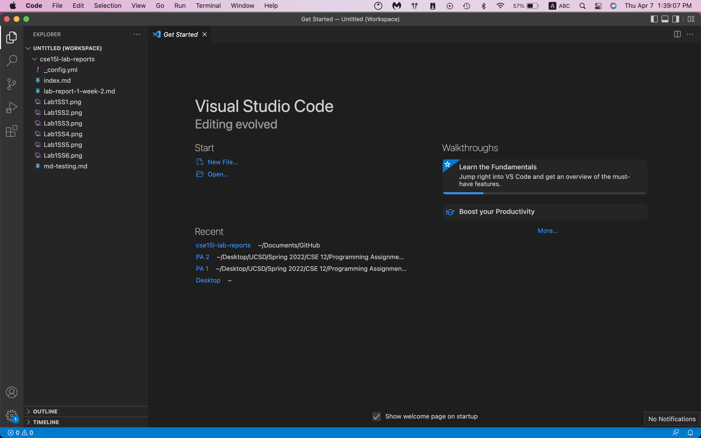

# Lab 1 - Remote Access
## Part 1 - Installing Visual Studio Code
To install Visual Studio Code, we simply need to follow these steps:  
1. Visit the [Visual Studio Code](https://code.visualstudio.com/download) website and download the application for your operating system. (I am using a Mac for this demonstration)
2. After unzipping the download file, open the Visual Studio Code application and follow the steps for setup.

After finishing setup, you should see a window similar to this (some details may be different depending on your settings):

## Part 2 - Remotely Connecting

## Part 3 - Trying Some Commands
## Part 4 - Moving Files with `scp`
## Part 5 - Setting an SSH Key
## Part 6 - Optimizing Remote Running
