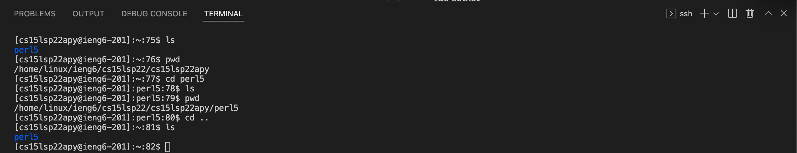

# Lab 1 - Remote Access
## Part 1 - Installing Visual Studio Code
To install Visual Studio Code, we simply need to follow these steps:

1. Visit the [Visual Studio Code](https://code.visualstudio.com/download) website and download the application for your operating system.
2. After unzipping the download file, open the Visual Studio Code application and follow the steps for setup.

After finishing setup, you should see a window similar to this (some details may be different depending on your settings):


## Part 2 - Remotely Connecting
For Window users only: [Install OpenSSH](https://docs.microsoft.com/en-us/windows-server/administration/openssh/openssh_install_firstuse)

To connect to the server, you need your course-specific account. Look that up [here](https://sdacs.ucsd.edu/~icc/index.php).

Then, to connect to the remote server, we are going to use Visual Studio Code's terminal. Open the terminal by navigating to Terminal -> New Terminal or an equivalent keyboard shortcut.

The terminal will look like this:


Enter the following command to initiate the connection (replace apy with letters in your course-specific account):

`$ ssh cs15lsp22apy@ieng6.ucsd.edu`

If it's your first time connecting, you will probably get a message along the lines of (taken from lab 1's tutorial):

```
$ ssh cs15lsp22apy@ieng6.ucsd.edu

The authenticity of host 'ieng6.ucsd.edu' (128.54.70.227) can't be estbalished.

RSA Key Fingerprint is
SHA256:ksruYwhnYH+sySHnHAtLUHngrPEyZTDl/1x99wUQcec.

Are you sure you want to continue connecting
(yes/no/[fingerprint])?
```

Enter yes to these messages to continue connecting to the remote server and enter your password whem prompted to do so.

After successfully logging in, you will see a series of messages similar to the following:


## Part 3 - Trying Some Commands
Some of the more common commands include `ls`, `pwd`, `cd`, `mkdir`, and `cp`. Running some of these commands will result in the following outcome:



To log out of the remote server, you can use Ctrl-D or type `exit`.

## Part 4 - Moving Files with `scp`
One key step in working remotely is the ability to transfer data between the *client* and the *server*.

The command to copy a file from the client to the server is called `scp` that will be run from the client.

As an example, we will transfer WhereAmI.java from our computer to the server.

First, create a new file named WhereAmI.java and input the following code:
```
   class WhereAmI {
      public static void main(String[] args) {
         System.out.println(System.getProperty("os.name"));
         System.out.println(System.getProperty("user.name"));
         System.out.println(System.getProperty("user.home"));
         System.out.println(System.getProperty("user.dir"));
      }
   }
```
## Part 5 - Setting an SSH Key
## Part 6 - Optimizing Remote Running
