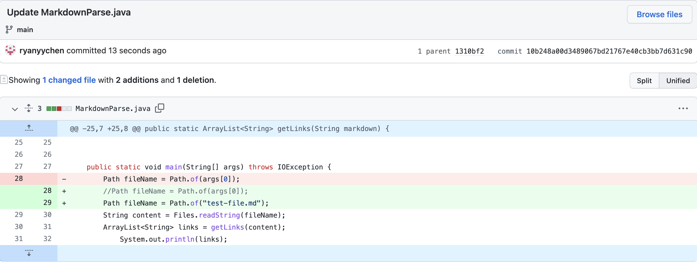
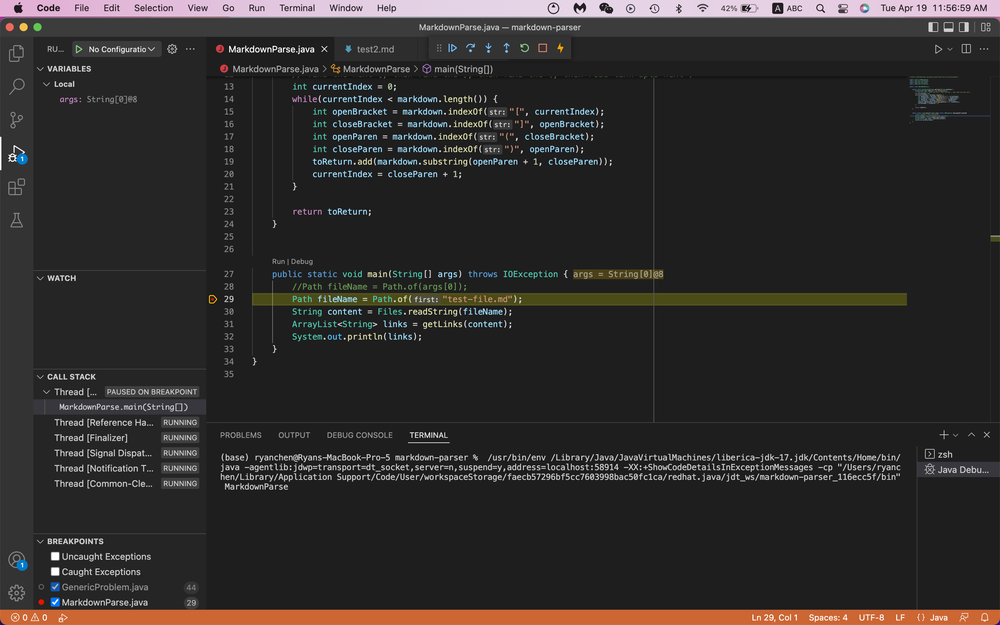
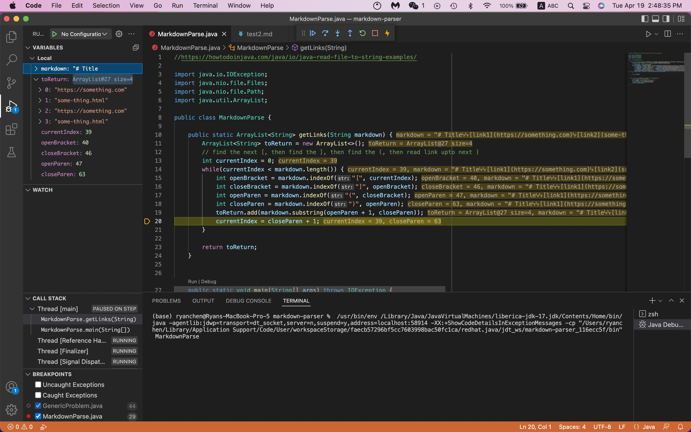
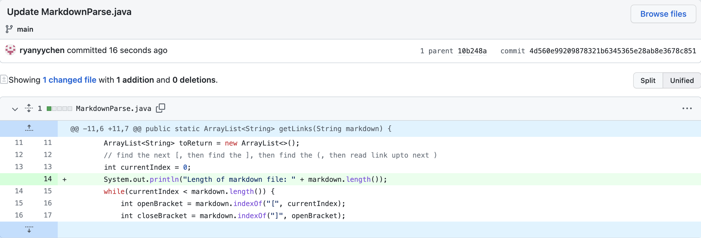
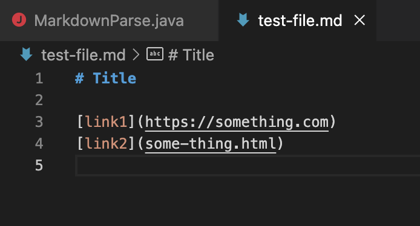
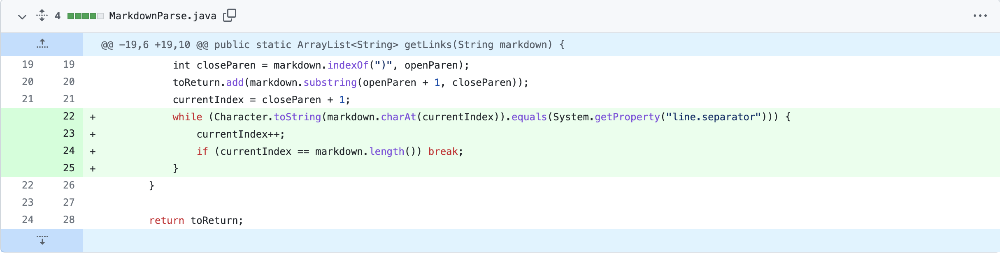
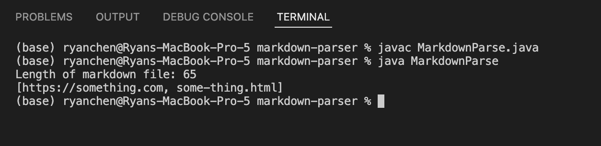
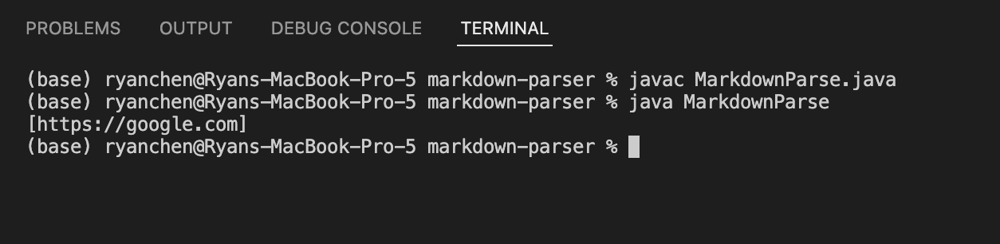
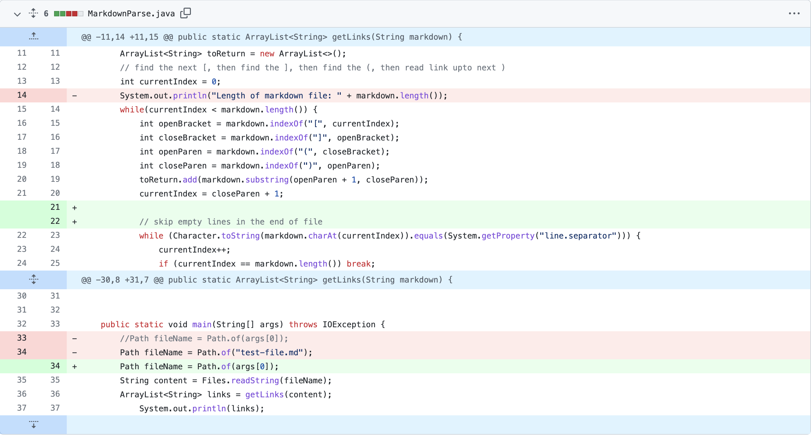

# Lab 3 - Debugging

Here's the link to the repository containing the code we are working with: <br>
https://github.com/nidhidhamnani/markdown-parser.git

## Step 1 - Identifying a Symptom
When trying to run the code with the given test file (*test-file.md*), we run into an OutOfMemoryError in the Java heap space:


This error is the symptom that the bug is causing. Now that a symptom is identified along with a failur-inducing input, we can take a look at the code to see which part of the code (aka the bug) is causing this error.

## Step 2 - Using the Debugger
Since the debugger does not allow for command line inputs when running the code (the args array), we can make an edit to the code so that it reads *test-file.md* like so:



Then, using the debugger in Visual Studio Code, we can go through the code line by line to identify where the bug is. To do so, we first need to set breakpoints so that we can use the debugger to run one line of code at a time.

We can set these breakpoints by first hovering our pointer over the area to the left of the line numbers and then clicking on the red circle that appears.

Then, we can navigate to the *Run and Debug* function using the control panel to the left and click the blue *Run and Debug* button to begin.

The interface of the debugger will look something like this:



As can be seen in the screenshot above, the debugger stopped at where I placed a breakpoint.

Using the control panel located in the middle at the top of the screen, we can control to the debugger to, in order from left to right, run until the next breakpoint, run the next line of code, step into a method, step out of a method, restart, or stop.

## Step 3 - Identifying the Bug
Using the debugger, I was bale to figure out that the while loop is the source of the bug. Specifically, the terminating condition for the loop is never reached.



As seen in the screenshot, in the variables section, the while loop has already ran twice to obtain the two URLs that are in the file. However, the terminating condition of `current index >= markdown.length` is never reached.

## Step 4 - Using Print Statements to Get Details
To properly understand why the bug exists, we need to get more details about the code and the failure-inducing input. Specific to this case, we should look at the length of the markdown file and the values of `currentIndex`.

I added a print statement for the length of the markdown file since it is not displayed in the debugger. This is so that I know the value that `currentIndex` should reach in order to terminate the loop.



Running the debugger again with this new print statement prints to the console the following line:

```
Length of markdown file: 65
```

Now that I know that currentIndex needs to reach 65 to terminate the loop, I can begin to identify the cause of the bug.

## Step 5 - Making an Assumption of the Cause of the bug
By tracing the values of `currentIndex` while the code runs, I find out that the largest value it reaches is 64, which is 1 less than the required 65 to end the loop.

Through looking at the code, the reason that `currentIndex` ends up at 64 is because it is set to `closeParen + 1`. Since the index of the close parenthesis character is 63, the value of `closeParen` is 63. However, due to the extra line at the end of the test file on line 5, (as shown in the screenshot below) there is a new line character which increases the length of the markdown file to 65.



This means that the code will only work for files which have no extra empty lines in the end and have the last character in the file as ")".

## Step 6 - Resolving the Bug
To tackle this bug, I thought of using another while loop inside the current loop to have the code skip new line characters so that it will reach the end of the file properly.

To do this, I looked up how to check for new line characters in java and used this [website](https://www.codegrepper.com/code-examples/java/how+to+check+new+line+character+in+java) as a reference.

Here is the edit that I made to the original file to resolve the bug caused by extra empty lines at the end of the file:



## Step 7 - Testing the Code
To make sure that the bug has been resolved by the changes made, I compiled and then ran the program again. Below is the output from the program:



As seen, the code now runs as expected: printing out the two URLs in the file in an array.

To make sure that the fix is applicable to other similar situations, I created a new test file with several (5) empty lines in the end.

The contents of the test file is as follows:
```
# Title

[link](https://google.com)


```

And the output of the program is:



This shows that the edit made to the code has indeed resolved the bug relating to empty lines in the end of the file.

## Step 8 - Cleaning Up the Code
The final step in this process of debugging is cleaning up the code by adding in-line comments and removing the print statements added for testing purposes.



## *Notes on Debugging*
If the attempt to resolve the bug does not work, try the following strategies:

- Attempt to reduce the size of the failure-inducing input
- Add more watchpoints or debug print statements
- Find a tool that can bring new information to light
- Take a step back and question your assumptions
- Talk to someone new and discuss if possible
- Stare at the code until you figure it out

In the end, the essence of debugging is figuring out where the code went wrong and trying to find a solution for it.